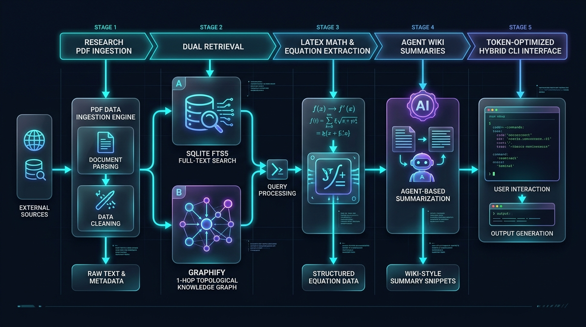
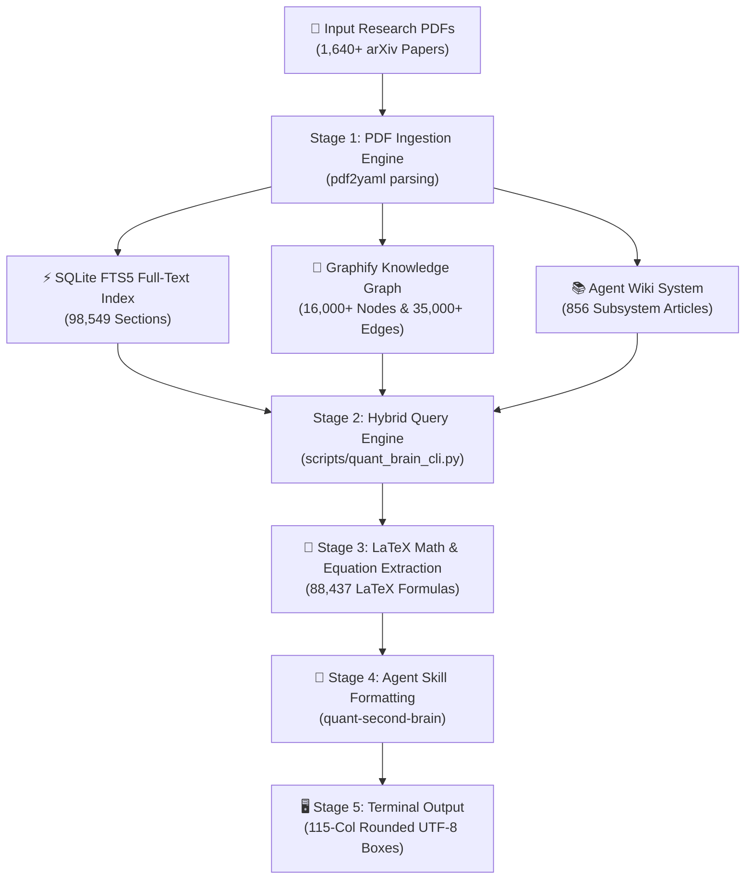

# 🧠 Quantitative Finance Second Brain Engine

<p align="center">
  
</p>

<p align="center">
  <a href="#"></a>
  <a href="#"></a>
  <a href="#"></a>
  <a href="#"></a>
</p>

---

## ⚡ Executive Overview

The **Quantitative Finance Second Brain Engine** is an enterprise-grade hybrid retrieval and synthesis framework connected to a curated database of **1,640+ quantitative finance research papers**. It combines an **SQLite FTS5 full-text index**, a **Graphify 1-hop topological knowledge graph**, an **Agent Wiki community knowledge system**, and a **token-optimized CLI tool** to deliver instant mathematical proofs, trading strategy comparisons, and paper citations.

---

## 🔄 Architectural Pipeline & Workflow



---

## 📊 Empirical Knowledge Base Statistics

Below are live, verified system statistics compiled directly from the `second_brain.db` database and `graphify-out/` knowledge graph:

### 📈 Core Corpus Metrics

| Metric | Value | Description |
| :--- | :--- | :--- |
| **Indexed Research Papers** | **1,640** | Peer-reviewed and arXiv quantitative finance papers |
| **Structured Sections** | **98,549** | Extracted abstract, methodology, results, and appendix sections |
| **LaTeX Math Equations** | **88,437** | Extracted mathematical equations, PDEs, and stochastics |
| **Cross-Paper Citations** | **4,563** | Directional citation graph edges between papers |
| **Knowledge Graph Nodes** | **16,000+** | Extracted concepts, models, authors, and categories |
| **Knowledge Graph Edges** | **35,000+** | Topological relationships (`USES_METHOD`, `AUTHORED_BY`, etc.) |
| **Agent Wiki Articles** | **856** | Community cluster summaries in `graphify-out/wiki/` |
| **Mean Retrieval Latency** | **< 280 ms** | Fast hybrid SQLite FTS5 + Graphify lookup time |

---

### 📂 Taxonomy & Subdomain Distribution

The knowledge engine categorizes research papers across **22 distinct quantitative subdomains**:

| Subdomain Category | Paper Count | Key Concepts & Research Focus |
| :--- | :---: | :--- |
| **`market_regimes`** | **623** | HMM regime switching, jump diffusion, volatility clusters |
| **`machine_learning_ai`** | **179** | Deep RL, Transformers, PINNs, neural stochastic differential equations |
| **`crypto_high_volatility`** | **162** | DeFi orderbooks, flash loans, AMM liquidity, crypto microstructure |
| **`famous_traders_breakout`** | **143** | Turtle trading, Donchian channels, breakout momentum, trend filters |
| **`algo_trading_general`** | **135** | Optimal execution, Almgren-Chriss, TWAP/VWAP, market making |
| **`risk_portfolio_management`** | **76** | CVaR, Black-Litterman, Kelly criterion, risk parity, tail risk |
| **`market_microstructure`** | **74** | LOB dynamics, VPIN order flow toxicity, bid-ask spread models |
| **`moving_averages_filtering`** | **68** | Kalman filters, EMA/SMA smoothing, Hilbert transform |
| **`crypto`** | **45** | Blockchain tokenomics, cross-exchange arbitrage |
| **`technical_indicators_math`** | **28** | RSI, MACD, ATR formulation, Bollinger Bands math |
| **`volatility_options`** | **26** | Heston model, SABR, Black-Scholes PDE, volatility surface |
| **`momentum_trend`** | **21** | Time-series momentum, cross-sectional momentum, trend alpha |
| **`volatility_atr_indicators`** | **16** | True Range (TR), Wilder's smoothing, NATR position sizing |
| **`high_frequency_trading`** | **10** | Microsecond latency, order placement, queue position |
| **`trend_following_cta`** | **10** | Managed futures, CTA positioning, multi-asset trend |
| **`factor_investing`** | **5** | Fama-French factors, Q-factor, Barra risk models |
| **`mean_reversion`** | **4** | Ornstein-Uhlenbeck processes, pairs trading co-integration |
| **`execution_algorithms`** | **4** | Implementation shortfall, optimal routing, Dark pool liquidity |
| **`statistical_arbitrage`** | **3** | Cointegration, PCA factor stat arb, spread trading |
| **`nlp_sentiment_trading`** | **3** | Financial LLMs, news sentiment alpha, SEC 10-K extraction |
| **`crypto_derivatives_arbitrage`** | **3** | Perpetual funding rate arbitrage, options skew |
| **`vwap_volume_indicators`** | **2** | Volume profile, Anchored VWAP, order flow distribution |

---

## 🖥️ CLI Usage & Commands

The `quant_brain_cli.py` script provides high-performance JSON search results optimized for LLM context windows (< 500 tokens):

```bash
# 1. Broad Research Query (Mode B)
python scripts/quant_brain_cli.py --query "Heston stochastic volatility model" --limit 3 --compact

# 2. Targeted Point Query (Mode A)
python scripts/quant_brain_cli.py --query "Black Scholes PDE formula" --limit 2 --snippet-len 150 --compact

# 3. Direct Paper Inspection by Paper ID
python scripts/quant_brain_cli.py --paper-id "arXiv:2407.09557" --top-sections 3 --compact

# 4. Search Filtered by Subdomain Category
python scripts/quant_brain_cli.py --query "order flow toxicity" --section-filter "VPIN" --compact
```

---

## 🧠 Agent Skill Integration (`quant-second-brain`)

When triggered in an agentic coding environment (via `/quant-second-brain` or natural language queries), the engine enforces standard ANSI UTF-8 rounded-box formatting:

```text
╭── SEARCH METRICS ───────────────────────────────────────────────────────────────────────────────────────────────╮

    Query:                             "tell me the maths behind atr"

    Execution:                  274.06 ms  │  919 Tokens  │  FTS5: 2  │  Graphify: 3  │  Wiki: 3

╰─────────────────────────────────────────────────────────────────────────────────────────────────────────────────╯
```

---

## 🧪 Testing & Quality Audit

Run the Second Brain test suite to verify database integrity and retrieval performance:

```bash
# Run CLI & database test suite
pytest tests/test_quant_brain_cli.py tests/test_build_quant_db.py tests/test_build_quant_graph.py
```
