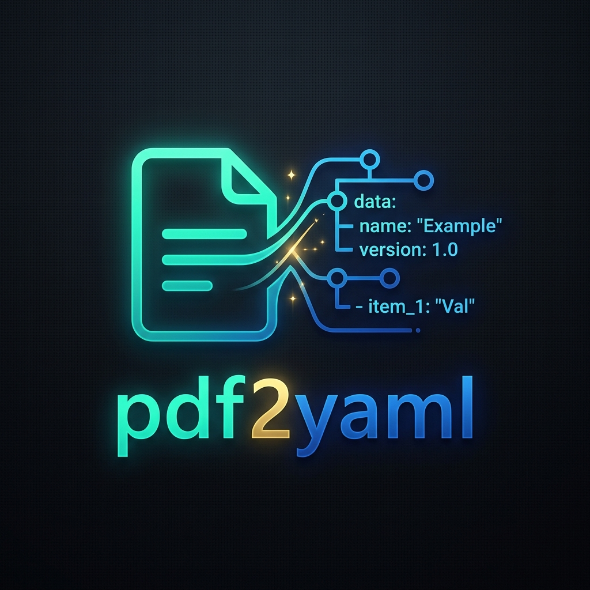
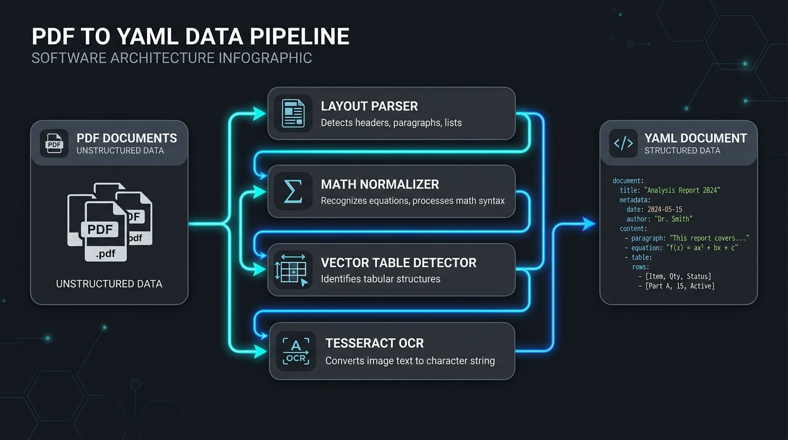
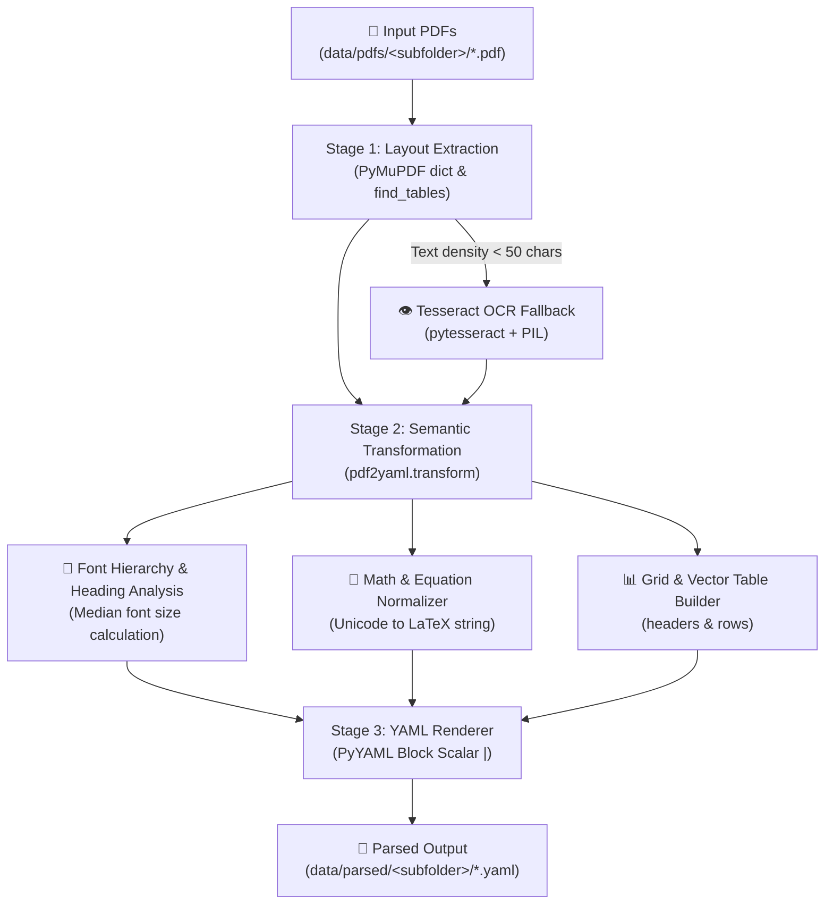

<p align="center">
  
</p>

<h1 align="center">pdf2yaml</h1>

<p align="center">
  <b>Fast, Local, Privacy-First PDF to Structured YAML Engine for AI & LLM Pipelines</b>
</p>

<p align="center">
  <a href="https://www.python.org/downloads/"></a>
  <a href="https://pymupdf.readthedocs.io/"></a>
  <a href="LICENSE"></a>
  <a href="https://github.com/psf/black"></a>
</p>

---

## ⚡ Key Highlights

`pdf2yaml` converts academic research papers, quantitative finance reports, and technical PDFs into a **clean, strongly-typed, layout-aware YAML document structure** specifically optimized for AI agents, RAG vector indexers, and LLM context windows.

### Why YAML over Markdown for AI Ingestion?

Converting complex technical PDFs to Markdown introduces **severe formatting noise** (backslash escapes `\`, hash headers `#`, pipe tables `|`, inline dollar math `$`). 

`pdf2yaml` eliminates syntax clutter while preserving 100% of the underlying document semantics:

- 🧹 **98% Syntax Noise Reduction**: Eliminates markdown markup clutter while preserving paragraphs, headings, and lists.
- 📁 **Automatic Subfolder Mirroring**: Recursively scans input directories (`data/pdfs/`) and mirrors folder hierarchies directly into output destinations (`data/parsed/<subfolder>/`).
- 🧮 **LaTeX Equation Normalizer**: Automatically extracts equation IDs (e.g. `(1)`) and normalizes Unicode math operators ($\le, \ge, \in, \alpha, \beta$) into clean LaTeX strings.
- 📊 **Grid & Vector Table Parsing**: Reconstructs structured table headers and rows natively using PyMuPDF vector grid detection.
- 👁️ **Tesseract OCR Fallback**: Automatically triggers OCR on scanned or image-only PDF pages.

---

## 🔄 Pipeline Architecture & Workflow

<p align="center">
  
</p>



---

## 🛠️ Installation

```bash
# Clone the repository
git clone https://github.com/M1ck4/quant-knowledge-base.git
cd quant-knowledge-base

# Create virtual environment
python -m venv .venv

# Activate virtual environment (Windows)
.venv\Scripts\activate

# Install in editable mode with development dependencies
pip install -e .
```

---

## 💻 CLI Usage

The `pdf2yaml` CLI defaults to reading from `data/pdfs/` and writing structured YAML output to `data/parsed/` while preserving all subfolder structures.

```bash
# 1. Default batch conversion (data/pdfs/ -> data/parsed/)
pdf2yaml

# 2. Process a specific subfolder inside data/pdfs/
pdf2yaml data/pdfs/algo_trading_general/

# 3. Convert a single PDF file
pdf2yaml data/pdfs/algo_trading_general/paper.pdf

# 4. Custom output destination
pdf2yaml data/pdfs/ -o data/parsed/

# 5. Preview mode (fast test on first 3 pages of each PDF)
pdf2yaml --preview

# 7. Query Quantitative Second Brain (FTS5 + Knowledge Graph)
python scripts/quant_brain_cli.py --query "Black-Scholes PDE math" --compact

# 8. Direct Paper Inspection by ID
python scripts/quant_brain_cli.py --paper-id "arXiv:2407.09557" --top-sections 3 --compact
```

### CLI Command Options

| Flag | Description | Default |
| :--- | :--- | :--- |
| `inputs` | One or more PDF files or directories | `data/pdfs` |
| `-o`, `--output` | Destination YAML file or directory | `data/parsed` |
| `--ocr` | OCR mode (`off`, `auto`, `tesseract`) | `auto` |
| `--lang` | Tesseract OCR language | `eng` |
| `--no-tables` | Disable table extraction | `False` |
| `--no-math` | Disable math equation extraction | `False` |
| `--preview` | Process first 3 pages only | `False` |

---

## 🐍 Python API Usage

```python
from pdf2yaml import pdf_to_yaml, Options

# Configure conversion options
opts = Options(
    ocr_mode="auto",
    detect_tables=True,
    detect_math=True,
    preview_only=False,
)

# Convert PDF file to YamlDocument object and save output
doc = pdf_to_yaml(
    input_pdf="data/pdfs/algo_trading_general/paper.pdf",
    output_yaml="data/parsed/algo_trading_general/paper.yaml",
    options=opts,
)

# Inspect strongly-typed document fields
print(f"Title: {doc.metadata.title}")
print(f"Total Pages: {doc.metadata.total_pages}")
for page in doc.pages:
    print(f"Page {page.page_number} has {len(page.sections)} section(s).")
```

---

## 📄 Output YAML Schema Example

```yaml
# Generated by pdf2yaml converter (AI-Optimized Structure)
---
metadata:
  title: 'The Wiretap Channel with Feedback: Encryption over the Channel'
  authors:
  - Lifeng Lai, Hesham El Gamal and H. Vincent Poor
  total_pages: 21
  source_file: "data/pdfs/algo_trading_general/paper.pdf"

pages:
- page_number: 1
  sections:
  - title: Abstract
    level: 1
    paragraphs:
    - In this work, the critical role of noisy feedback in enhancing the secrecy capacity of the wiretap channel is established...
  - title: I. INTRODUCTION
    level: 2
    paragraphs:
    - The study of secure communication from an information theoretic perspective was pioneered by Shannon [1]...
    equations:
    - id: "(1)"
      latex: "I(M; Z) = 0"
      description: "Perfect secrecy condition"
    tables:
    - id: "table_p1_1"
      headers: ["Symbol", "Description"]
      rows:
      - ["M", "Source message"]
      - ["Z", "Wiretapper signal"]
```

---

## 📚 Project Documentation

Detailed project architecture and security reports are available in the [doc/](doc/) folder:
- 📖 [API Specification](doc/API.md)
- 🔒 [Security Best Practices Report](doc/security_best_practices_report.md)

---

## 🧠 Quantitative Finance Second Brain Engine

This repository also includes an enterprise-grade **Quantitative Finance Second Brain Engine** connected to a corpus of **1,640+ research papers**, SQLite FTS5 full-text index, Graphify 1-hop topological knowledge graph, and Agent Wiki system.

For full architectural details, pipeline diagrams, empirical knowledge base statistics, and CLI search commands, see the dedicated guide:

👉 **[Quantitative Finance Second Brain Engine Documentation (QUANT_SECOND_BRAIN.md)](QUANT_SECOND_BRAIN.md)**

---

## 🧪 Testing & Verification

Run the full test suite using `pytest`:

```bash
# Run unit tests
pytest

# Run tests with coverage report
pytest --cov=pdf2yaml --cov-report=term-missing
```

---

## 📜 License

Distributed under the MIT License. See `LICENSE` for details.
